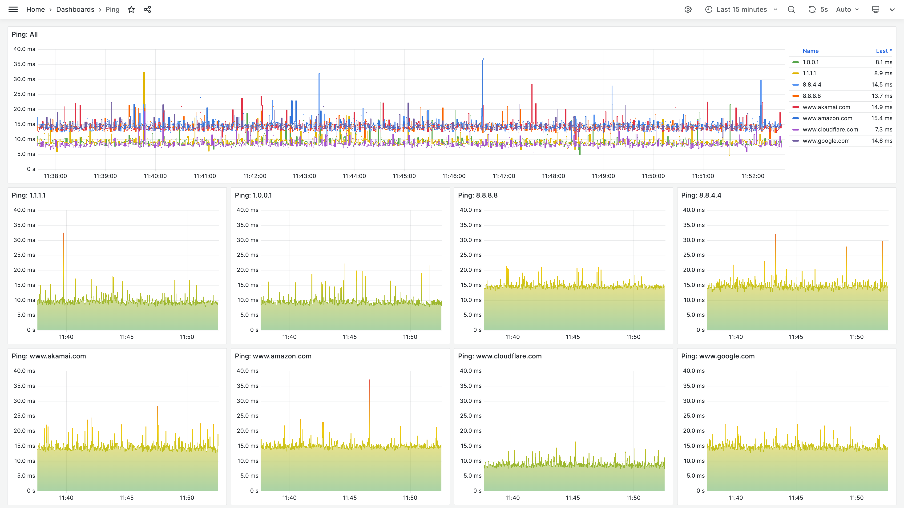

# telegraf-better-ping

A better Ping monitoring plugin for Telegraf / InfluxDB



## Why the stock Ping plugin is not good enough?

<https://github.com/influxdata/telegraf/issues/11145#issuecomment-1809246992>

## Command line interface

This program can be run independently without Telegraf.
```
Usage:
  telegraf-better-ping {[OPTIONS] [--dest=]DESTINATION} [[OPTIONS] [--dest=]DESTINATION]...

Options:
  --comment=COMMENT     Comment of the following destination.
  [--dest=]DESTINATION  The destination address to send packets to.
                        The text "--dest=" can be omitted.
  --host-tag TAG        Add an extra "host" tag to the InfluxDB entries.
  --prefer-ipv6         Prefer IPv6 / ICMPv6 protocol,
                        fallback to IPv4 / ICMP. The default mode.
  -4                    Use IPv4 / ICMP protocol.
  -6                    Use IPv6 / ICMPv6 protocol.
  -I SOURCE             The source address to send packets from.
  -i INTERVAL           Wait INTERVAL seconds between sending each packet.
                        Must be greater or equal to 0.002 seconds.
  -s SIZE               The number of data bytes to be sent. The default is 56.
                        Must be between 40 and 65528.

Notes:
  All options, except for --comment, only affect the destinations followed by.
  The option --comment only affects the single destination followed by.
  The last command line argument must be a destination.
```

For example:
```bash
$ sudo setcap cap_net_raw,cap_net_bind_service+ep ./telegraf-better-ping
$ ./telegraf-better-ping \
    --comment='Cloudflare DNS IPv4 (main)'   1.1.1.1 \
    --comment='Cloudflare DNS IPv4 (backup)' 1.0.0.1 \
    --comment='Cloudflare DNS IPv6 (main)'   2606:4700:4700::1111 \
    --comment='Cloudflare DNS IPv6 (backup)' 2606:4700:4700::1001 \
    --comment='Google DNS IPv4 (main)'       8.8.8.8 \
    --comment='Google DNS IPv4 (backup)'     8.8.4.4 \
    --comment='Google DNS IPv6 (main)'       2001:4860:4860::8888 \
    --comment='Google DNS IPv6 (backup)'     2001:4860:4860::8844 \
    --comment='Akamai WWW IPv4'           -4 www.akamai.com \
    --comment='Akamai WWW IPv6'           -6 www.akamai.com \
    --comment='Amazon WWW IPv4'           -4 www.amazon.com \
    --comment='Amazon WWW IPv6'           -6 www.amazon.com \
    --comment='Cloudflare WWW IPv4'       -4 www.cloudflare.com \
    --comment='Cloudflare WWW IPv6'       -6 www.cloudflare.com \
    --comment='Google WWW IPv4'           -4 www.google.com \
    --comment='Google WWW IPv6'           -6 www.google.com
```

It prints out Ping responses to standard output, in the [InfluxDB line protocol](https://docs.influxdata.com/influxdb/v2/reference/syntax/line-protocol/) format.
```
# PING 192.168.0.2 with 56 bytes of data, will start in 0.250 seconds.
# PING 2001:db8::2 with 56 bytes of data, will start in 0.750 seconds.
ping,dest=192.168.0.2 size=64u,reply_from="192.168.0.2",reply_to="192.168.0.1",icmp_id=43690u,icmp_seq=1u,hop_limit=64u,rtt=0.001000000 1700000000250000000
ping,dest=2001:db8::2 size=64u,reply_from="2001:db8::2",reply_to="2001:db8::1",icmp_id=52428u,icmp_seq=1u,hop_limit=64u,rtt=0.001000000 1700000000750000000
ping,dest=192.168.0.2 size=64u,reply_from="192.168.0.2",reply_to="192.168.0.1",icmp_id=43690u,icmp_seq=2u,hop_limit=64u,rtt=0.001000000 1700000001250000000
ping,dest=2001:db8::2 size=64u,reply_from="2001:db8::2",reply_to="2001:db8::1",icmp_id=52428u,icmp_seq=2u,hop_limit=64u,rtt=0.001000000 1700000001750000000
ping,dest=192.168.0.2 size=64u,reply_from="192.168.0.2",reply_to="192.168.0.1",icmp_id=43690u,icmp_seq=3u,hop_limit=64u,rtt=0.001000000 1700000002250000000
ping,dest=2001:db8::2 size=64u,reply_from="2001:db8::2",reply_to="2001:db8::1",icmp_id=52428u,icmp_seq=3u,hop_limit=64u,rtt=0.001000000 1700000002750000000
ping,dest=192.168.0.2 size=64u,reply_from="192.168.0.2",reply_to="192.168.0.1",icmp_id=43690u,icmp_seq=4u,hop_limit=64u,rtt=0.001000000 1700000003250000000
ping,dest=2001:db8::2 size=64u,reply_from="2001:db8::2",reply_to="2001:db8::1",icmp_id=52428u,icmp_seq=4u,hop_limit=64u,rtt=0.001000000 1700000003750000000
# ...
```

## Running in Docker

### 1. Setting up database storage

First, create a directory outside Docker to store databases, so you will not lose it during future upgrades:
```bash
$ sudo mkdir -p /var/lib/docker-volumes/{grafana,influxdb}/data
$ sudo chown 472:0 /var/lib/docker-volumes/grafana/data
$ sudo chown 1000:1000 /var/lib/docker-volumes/influxdb/data
```

### 2. Setting up InfluxDB

```bash
$ docker pull influxdb:latest
$ docker create --name influxdb-1 \
    -p 127.0.0.1:8086:8086/tcp \
    -v /var/lib/docker-volumes/influxdb/data:/var/lib/influxdb2 \
    influxdb:latest
$ docker start influxdb-1
```

Open your browser, go to `http://127.0.0.1:8086` to go through the first-time setup.

Take notes of:
* Your operator token
* Your username and password
* Your organization name and bucket name

(**Warning:** The “Copy to Clipboard” button may be broken. Please copy the token manually!)

Log into `http://127.0.0.1:8086`, choose “Load Data” → “Bucket” from the left-side menu.

Choose “Settings” next to your bucket, select a retention period as your wish. Any data older than the specified period will be deleted.

### 3. Setting up Telegraf-better-ping

#### 3.a. Easy method: Passing configuration through environment variables.

Log into `http://127.0.0.1:8086`, choose “Load Data” → “API Tokens” from the left-side menu.

Choose “Generate API Token” → “Custom API Token”. Use the following settings:
* Description: `Telegraf-better-ping`
* Buckets → `<your bucket name>`: Write

Take note of your Telegraf-better-ping token.

(**Warning:** The “Copy to Clipboard” button may be broken. Please copy the token manually!)

```bash
$ docker pull m13253/telegraf-better-ping:latest
$ docker create --name telegraf-better-ping-1 \
    --link influxdb-1:influxdb \
    -e INFLUX_URL='http://influxdb:8086' \
    -e INFLUX_TOKEN='<your Telegraf-better-ping token>' \
    -e INFLUX_ORG='<your organization name>' \
    -e INFLUX_BUCKET='<your bucket name>' \
    -e TELEGRAF_BETTER_PING_ARGS='<your telegraf-better-ping command line arguments>'
    m13253/telegraf-better-ping:latest
$ docker start telegraf-better-ping-1
```
Refer to the Section [Command line interface](#command-line-interface) to learn how to configure `TELEGRAF_BETTER_PING_ARGS`.

#### 3.b. Alternative method: Use InfluxDB to distribute Telegraf configuration files.

Log into `http://127.0.0.1:8086`, choose “Load Data” → “Telegraf” from the left-side menu.

Choose “Create a Telegraf Configuration”. Use the following settings:
* Bucket: `<your bucket name>`
* Source: Execd

Make the following modification:
```toml
[[inputs.execd]]
  command = [
    "telegraf-better-ping",
    "<my", "telegraf-better-ping", "command", "line", "arguments", "but", "splitted>",
  ]
```
Refer to the Section [Command line interface](#command-line-interface) to learn how to configure the command line arguments.

Click “Save and Test”. Take notes of:
* The API token
* The configuration URL, but change `127.0.0.1` to `telegraf`

(**Warning:** The “Copy to Clipboard” button may be broken. Please copy the token manually!)

Edit the newly added Telegraf configuration, make the following modifications:
```toml
[agent]
  interval = "1s"
  flush_interval = "1s"
  precision = "1ns"
[[outputs.influxdb_v2]]
  urls = ["http://telegraf:8086"]
```

```bash
$ docker pull m13253/telegraf-better-ping:latest
$ docker create --name telegraf-better-ping-1 \
    --link influxdb-1:influxdb \
    -e INFLUX_TOKEN='<your API token>' \
    m13253/telegraf-better-ping:latest \
    --config 'http://telegraf:8086/api/v2/telegrafs/<my configuration URL>'
$ docker start telegraf-better-ping-1
```

### 4. Setting up Grafana

Log into `http://127.0.0.1:8086` again, choose “Load Data” → “API Tokens” from the left-side menu.

Choose “Generate API Token” → “Custom API Token”. Use the following settings:
* Description: `Grafana`
* Buckets → `<your bucket name>`: Read

Take note of your Grafana token.

(**Warning:** The “Copy to Clipboard” button may be broken. Please copy the token manually!)

```bash
$ docker pull grafana/grafana:latest
$ docker create --name grafana-1 \
    --link influxdb-1:influxdb \
    -p 127.0.0.1:3000:3000/tcp \
    -v /var/lib/docker-volumes/grafana/data:/var/lib/grafana \
    grafana/grafana:latest
$ docker start grafana-1
```

Go to `http://127.0.0.1:3000`, log in with username `admin` and password `admin`. Then change your password. You can also change your username in your profile settings.

Choose “Connections” → “Data sources” from the left-side menu.

Add a new data source using the following settings:
* Type: InfluxDB
* Query language: Flux
* URL: `http://influxdb:8086`
* Basic auth: off
* Organization: `<your organization name>`
* Token: `<your Grafana token>`
* Min time interval: 1ms

### 5. Designing your Grafana dashboard

#### 5.1. Round-trip time (RTT)

Go to `http://127.0.0.1:3000`, choose “Dashboards” from the left-side menu. Choose “Create Dashboard”.

Choose the “⚙” icon in the top-right corner. Use the following settings:
* Title: `Ping: RTT`
* Refresh live dashboards: on
* Graph tooltip: Shared crosshair

Choose “Variables”, add 3 new variables. Use the following settings:
* Variable 1:
  * Select variable type: Data source
  * Name: `dataSource`
  * Label: `Data Source`
  * Type: `InfluxDB`

  Choose “Run query”, make sure it shows `InfluxDB` and `default`. Then, choose “Apply”.

* Variable 2:
  * Select variable type: Interval
  * Name: `aggregationInterval`
  * Label: `Aggregation Interval`
  * Values: `Minimum,1s,5s,15s,30s,1m,5m,15m,30m,1h,3h,6h,12h,1d`

  Choose “Run query”, make sure it shows all intervals. Then, choose “Apply”.

* Variable 3:
  * Select variable type: Interval
  * Name: `movingAveragePeriod`
  * Label: `Moving Average Period`
  * Values: `Off,1s,5s,15s,30s,1m,5m,15m,30m,1h,3h,6h,12h,1d,2d,7d,30d,90d`

  Choose “Run query”, make sure it shows all periods. Then, choose “Apply”.

Choose “Close” in the top-right corner.

Set time range to “Last 15 minutes” and refresh rate to “Auto” in the top-right corner.

Change the current selected variable values in the top-left corner:
* Data Source: `InfluxDB`
* Aggregation Interval: Minimum
* Moving Average Period: Minimum

Go back and add 2 more variables:
* Variable 4:
  * Name: `bucket`
  * Label: `Bucket`
  * Data source: `${dataSource}`
  * Query:
    ```julia
    buckets()
    ```

  Choose “Run query”, make sure it shows your bucket name. Then, choose “Apply”.

* Variable 5:
  * Name: `name`
  * Label: `Destination / Comment`
  * Data source: `${dataSource}`
  * Query:
    ```julia
    from(bucket: "${bucket}")
        |> range(start: v.timeRangeStart, stop: v.timeRangeStop)
        |> filter(fn: (r) => r._measurement == "ping" and r._field == "rtt")
        |> map(fn: (r) => ({_value: if exists r.comment then r.comment else r.dest}))
        |> unique()
    ```
  * Multi-value: yes
  * Include All option: yes

  Choose “Run query”, make sure it shows all your Ping destinations. Then, choose “Apply”.

Choose “Close” in the top-right corner.

Change the current selected variable values in the top-left corner:
* Data Source: InfluxDB
* Aggregation Interval: Minimum
* Moving Average Period: Off
* Bucket: `<your bucket name>`
* Destination / Comment: All

Choose “Add” → “Visualization” in the top-right corner. Use the following settings:
* Query:
  * Data source: `${dataSource}`
  * Query:
    ```julia
    import "date"

    aggregationInterval =
        if "${aggregationInterval}" != "Minimum" and int(v: duration(v: "${aggregationInterval}")) > int(v: v.windowPeriod) then
            duration(v: "${aggregationInterval}")
        else
            v.windowPeriod
    movingAveragePeriod =
        if "${movingAveragePeriod}" != "Off" and int(v: duration(v: "${movingAveragePeriod}")) > int(v: aggregationInterval) then
            duration(v: "${movingAveragePeriod}")
        else
            aggregationInterval

    data = from(bucket: "${bucket}")
        |> range(start: date.sub(from: v.timeRangeStart, d: movingAveragePeriod), stop: date.add(to: v.timeRangeStop, d: movingAveragePeriod))
        |> filter(fn: (r) => r._measurement == "ping" and r._field == "rtt" and (r.comment == "${name}" or not exists r.comment and r.dest == "${name}"))
        |> aggregateWindow(every: aggregationInterval, fn: max, createEmpty: false)
        |> map(fn: (r) => ({r with name: if exists r.comment then r.comment else r.dest}))
        |> group(columns: ["_time", "_value"], mode: "except")

    if int(v: movingAveragePeriod) > int(v: aggregationInterval) then
        data |> timedMovingAverage(every: aggregationInterval, period: movingAveragePeriod)
    else
        data
    ```

    **Note:** Alternatively, you may want to use `"mean"` (instead of `"max"`) if you care about the average RTT (instead of the spikes) within each aggregation window.

* Panel options:
  * Title: `RTT: ${name}`
  * Repeat options:
    * Repeat by variable: `name`
    * Max per row: 4
* Tooltip:
  * Tooltip mode: All
  * Values sort order: Descending
* Legend:
  * Visibility: off
* Graph styles:
  * Line interpolation: Step before
  * Fill opacity: 50
  * Gradient mode: Scheme
* Standard options:
  * Unit: `seconds (s)`
  * Min: 0
  * Decimals: 1
  * Display name: `${__field.labels.name}`
  * Color scheme: Green-Yellow-Red (by value)

Choose “Apply” in the top-right corner.

Then, go back to dashboard settings. Change the following settings:
* Variables → `dataSource`:
  * Show on dashboard: Nothing
* Variables → `bucket`:
  * Show on dashboard: Nothing
* Variables → `name`:
  * Show on dashboard: Nothing
* General
  * Editable: Read-only

Then, choose “💾” icon or “Save dashboard” button in the top-right corner.

Save your dashboard. If asked, set the following options:
* Save current time range as dashboard default: yes
* Save current variable values as dashboard default: yes

Sometimes your modifications are not reflected to all repeated visualization panels. If that happens, reload your web page.

#### 5.2. Packet loss rate

Similarly, create a new dashboard named `Ping: Loss` with the same variables.

Add a new visualization titled `Loss` to the new dashboard. Use the following settings:
* Query:
  * Data source: `${dataSource}`
  * Query:
    ```julia
    import "date"

    aggregationInterval =
        if "${aggregationInterval}" != "Minimum" and int(v: duration(v: "${aggregationInterval}")) > int(v: v.windowPeriod) then
            duration(v: "${aggregationInterval}")
        else
            v.windowPeriod
    movingAveragePeriod =
        if "${movingAveragePeriod}" != "Off" and int(v: duration(v: "${movingAveragePeriod}")) > int(v: aggregationInterval) then
            duration(v: "${movingAveragePeriod}")
        else
            aggregationInterval

    data = from(bucket: "${bucket}")
        |> range(start: date.sub(from: v.timeRangeStart, d: movingAveragePeriod), stop: date.add(to: v.timeRangeStop, d: movingAveragePeriod))
        |> filter(fn: (r) => r._measurement == "ping" and r._field == "icmp_seq" and (r.comment == "${name}" or not exists r.comment and r.dest == "${name}"))
        |> difference()
        |> map(fn: (r) => ({r with _value: float(v: (r._value + 98304) % 65536 - 32768)}))
        |> aggregateWindow(every: aggregationInterval, fn: mean, createEmpty: false)
        |> map(fn: (r) => ({r with _value: 1.0 - 1.0 / r._value, name: if exists r.comment then r.comment else r.dest}))
        |> group(columns: ["_time", "_value"], mode: "except")

    if int(v: movingAveragePeriod) > int(v: aggregationInterval) then
        data |> timedMovingAverage(every: aggregationInterval, period: movingAveragePeriod)
    else
        data
    ```

    **Note 1:** The formula first calculates the total difference in ICMP sequence number within each aggregation window, reflecting the number of Pings sent. Then, divide the number of measurements in the window (in other words, the number of replies received) by the number of Pings sent, producing the packet delivery rate. Finally, subtract the packet delivery rate from 100%, and we get the packet loss rate. Additionally, the code above properly handles the ICMP sequence number rollover by splitting the difference calculation into small steps.

    **Note 2:** Out-of-order deliveries may produce a pair of positive and negative spikes if these measurements are located in separate aggregation windows. However, a wider Moving Average Period can flatten the spikes out, and the overall mean is still accurate.

    **Note 3:** However, restarting Telegraf-better-ping will produce a huge spike on the graph. Please wait for the Moving Average Period to pass, so the graph can settle down.

    **Note 4:** If your Ping destination is multicast, you might need to modify the loss rate formula.

* Panel options:
  * Title: `Loss: ${name}`
  * Repeat options:
    * Repeat by variable: `name`
    * Max per row: 4
* Tooltip:
  * Tooltip mode: All
  * Values sort order: Descending
* Legend:
  * Visibility: off
* Graph styles:
  * Line interpolation: Step before
  * Fill opacity: 50
  * Gradient mode: Scheme
* Standard options:
  * Unit: `Percent (0.0-1.0)`
  * Min: 0
  * Max: 0.1
  * Decimals: 1
  * Display name: `${__field.labels.name}`
  * Color scheme: Green-Yellow-Red (by value)

## Caveats

### DNS Caching

Telegraf-better-ping does not cache DNS responses. Therefore, the provided Docker container image has [Dnsmasq](https://dnsmasq.org) preinstalled, which caches DNS responses for Telegraf-better-ping.

If you run Telegraf-better-ping without the provided Docker container image, you need to ensure DNS caching is working properly to prevent Telegraf-better-ping from sending out too one DNS request per interval.

### IPv6 connectivity

Docker comes with no IPv6 connectivity by default.

Please refer to the [Docker manuals](https://docs.docker.com/config/daemon/ipv6/) to enable IPv6 support.

Alternatively, you can also run Telegraf-better-ping [using the host network](https://docs.docker.com/network/network-tutorial-host/) without enabling IPv6 inside Docker networks. However, be aware that host network may not support `--link`.
